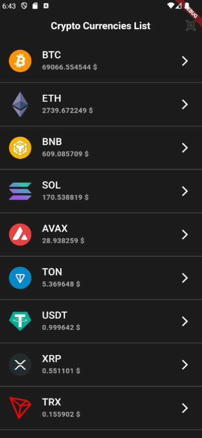

# cripto_coins_list

A new Flutter project.

Описание проекта:
Открывается список 10 криптовалют, запрашивается их стоимость в долларах. По каждой криптовалюте можно открыть экран с подробностями, где представлен график японских свечей за последние 30 дней и показывается процент, на который валюта выросла / упала за месяц.

Демонстрация работы:
В папке assets/images можно посмотреть, как выглядят два экрана приложения.
гифка:

Для запуска проекта:
достаточно версии flutter 3.24.3 • Dart 3.5.3 • DevTools 2.37.3
запуск из файла main.dart
